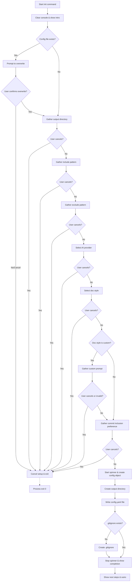

# registerInitCommand

Registers the `init` command with the CLI application, providing an interactive setup wizard that guides users through initializing syncdocs in their project. The command prompts for configuration options and creates the necessary directory structure and configuration files.

<details>
<summary>Visual Flow</summary>



</details>

<details>
<summary>Parameters</summary>

| Parameter | Type | Description |
|-----------|------|-------------|
| `cli` | `CAC` | The CAC (Command and Conquer) CLI instance to register the command with |

</details>

<details>
<summary>Return Value</summary>

Returns `void`. The function registers the command with the CLI instance but doesn't return any value. The registered command action is asynchronous and handles its own lifecycle including process exit on cancellation.

</details>

<details>
<summary>Usage Examples</summary>

```typescript
import { CAC } from 'cac';
import { registerInitCommand } from './commands';

// Basic usage - register the init command with a CLI instance
const cli = new CAC();
registerInitCommand(cli);

// The command can then be invoked from the command line
// $ myapp init
```

```typescript
// In a larger CLI application setup
import { CAC } from 'cac';
import { registerInitCommand } from './commands/init';

function setupCLI() {
  const cli = new CAC('syncdocs');
  
  // Register multiple commands
  registerInitCommand(cli);
  // ... other commands
  
  cli.parse();
}

setupCLI();
```

</details>

<details>
<summary>Implementation Details</summary>

The function creates an interactive command-line wizard using the `p` prompting library that:

1. **Checks for existing configuration**: Looks for `_syncdocs/config.yaml` in the current working directory
2. **Handles overwrite scenarios**: Prompts user if configuration already exists
3. **Collects user preferences**: Gathers configuration through a series of prompts:
   - Output directory path
   - File inclusion patterns (glob format)
   - File exclusion patterns (comma-separated)
   - AI provider selection (`anthropic`, `openai`, or `claude-code`)
   - Documentation style (`senior`, `onboarding`, or `custom`)
   - Custom prompt (if custom style selected)
   - Git commit message inclusion preference

4. **Validates input**: Ensures required fields like custom prompts are not empty
5. **Generates configuration**: Creates an `InitConfig` object with structured settings
6. **Creates filesystem artifacts**:
   - Creates the output directory (with recursive flag)
   - Writes YAML configuration file
   - Creates `.gitignore` if it doesn't exist

The command uses consistent cancellation handling - any cancelled prompt results in a graceful exit with `process.exit(0)`.

</details>

<details>
<summary>Edge Cases</summary>

- **Cancellation at any prompt**: User pressing Ctrl+C or ESC will trigger cancellation flow and exit the process
- **Existing configuration**: If `config.yaml` already exists, user must explicitly confirm overwrite or setup is cancelled
- **Custom prompt validation**: When selecting custom documentation style, the prompt text is required and validated
- **Directory creation**: Uses recursive directory creation to handle nested output paths
- **Missing .gitignore**: Creates a basic `.gitignore` with `node_modules` entry if none exists
- **Comma-separated exclusions**: The exclude pattern input is parsed by splitting on commas and trimming whitespace
- **Empty exclusion patterns**: Filters out empty strings from the exclusion list after splitting

</details>

<details>
<summary>Related</summary>

- `getPromptForStyle()` - Generates appropriate prompts based on selected documentation style
- `generateConfigYAML()` - Converts the configuration object to YAML format
- `InitConfig` interface - Type definition for the configuration structure
- Other CLI command registration functions in the same module
- CAC library documentation for command registration patterns

</details>