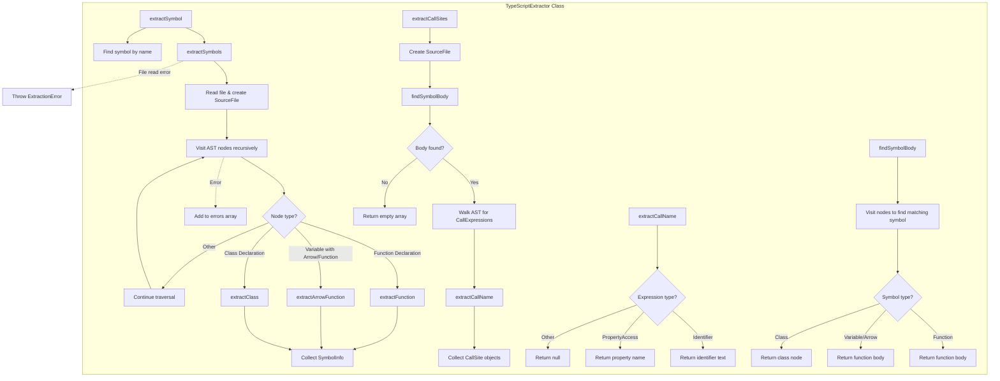

# TypeScriptExtractor

A class for extracting and analyzing TypeScript/JavaScript symbols (functions, classes, arrow functions) from source files using the TypeScript compiler API. It parses source code into AST nodes and extracts detailed symbol information including parameters, body content, and call site analysis.

<details>
<summary>Visual Flow</summary>



</details>

<details>
<summary>Methods</summary>

## `extractSymbols(filePath: string): ExtractionResult`
Extracts all symbols (functions, classes, arrow functions) from a TypeScript/JavaScript file. Returns an `ExtractionResult` containing an array of `SymbolInfo` objects and any extraction errors encountered.

## `extractSymbol(filePath: string, symbolName: string): SymbolInfo | null`
Extracts a single symbol by name from the specified file. Returns the `SymbolInfo` object if found, or `null` if the symbol doesn't exist.

## `extractCallSites(filePath: string, symbolName: string): CallSite[]`
Analyzes a symbol's body to find all function/method calls made within it. Returns an array of `CallSite` objects containing the call name and full expression.

## Private Methods

### `findSymbolBody(sourceFile: SourceFile, symbolName: string): Node | null`
Locates the AST node representing the body of a named symbol (function body, arrow function body, or class node).

### `extractCallName(expr: Expression, sourceFile: SourceFile): string | null`
Extracts the callable function name from a call expression, handling identifiers (`foo()`) and property access (`obj.method()`).

### `extractFunction(node: FunctionDeclaration, sourceFile: SourceFile): SymbolInfo`
Processes function declarations and extracts comprehensive symbol information including parameters, body, and location data.

### `extractArrowFunction(decl: VariableDeclaration, sourceFile: SourceFile): SymbolInfo`
Handles arrow functions and function expressions assigned to variables, normalizing their body format.

### `extractClass(node: ClassDeclaration, sourceFile: SourceFile): SymbolInfo`
Processes class declarations and extracts class-level symbol information.

</details>

<details>
<summary>Return Value</summary>

## `extractSymbols()` Returns: `ExtractionResult`
```typescript
{
  symbols: SymbolInfo[];  // Array of extracted symbol information
  errors: string[];       // Any extraction errors encountered
}
```

## `extractSymbol()` Returns: `SymbolInfo | null`
Returns a single `SymbolInfo` object or `null` if the symbol is not found.

## `extractCallSites()` Returns: `CallSite[]`
```typescript
{
  name: string;        // Function name being called
  expression: string;  // Full call expression
}[]
```

## `SymbolInfo` Structure
```typescript
{
  name: string;      // Symbol name
  kind: 'function' | 'const' | 'class';
  filePath: string;  // Source file path
  params: string;    // Parameter list as string
  body: string;      // Symbol body content
  fullText: string;  // Complete symbol text
  startLine: number; // Starting line number (1-based)
  endLine: number;   // Ending line number (1-based)
}
```

</details>

<details>
<summary>Usage Examples</summary>

## Extract All Symbols
```typescript
const extractor = new TypeScriptExtractor();
const result = extractor.extractSymbols('./src/utils.ts');

console.log(`Found ${result.symbols.length} symbols`);
result.symbols.forEach(symbol => {
  console.log(`${symbol.kind}: ${symbol.name} (lines ${symbol.startLine}-${symbol.endLine})`);
});

if (result.errors.length > 0) {
  console.log('Extraction errors:', result.errors);
}
```

## Extract Specific Symbol
```typescript
const extractor = new TypeScriptExtractor();
const symbol = extractor.extractSymbol('./src/api.ts', 'fetchUserData');

if (symbol) {
  console.log(`Function: ${symbol.name}`);
  console.log(`Parameters: ${symbol.params}`);
  console.log(`Body preview: ${symbol.body.substring(0, 100)}...`);
} else {
  console.log('Symbol not found');
}
```

## Analyze Call Sites
```typescript
const extractor = new TypeScriptExtractor();
const callSites = extractor.extractCallSites('./src/service.ts', 'processData');

console.log('Functions called by processData:');
callSites.forEach(call => {
  console.log(`- ${call.name} (${call.expression})`);
});
```

## Handle Different Symbol Types
```typescript
const extractor = new TypeScriptExtractor();
const result = extractor.extractSymbols('./src/components.tsx');

result.symbols.forEach(symbol => {
  switch (symbol.kind) {
    case 'function':
      console.log(`Function declaration: ${symbol.name}`);
      break;
    case 'const':
      console.log(`Arrow function/const: ${symbol.name}`);
      break;
    case 'class':
      console.log(`Class: ${symbol.name}`);
      break;
  }
});
```

</details>

<details>
<summary>Implementation Details</summary>

## AST Processing
The extractor uses the TypeScript compiler API (`ts.createSourceFile`) to parse source code into Abstract Syntax Trees. It recursively visits each AST node using `ts.forEachChild()` to identify and process different symbol types.

## Symbol Type Detection
- **Function Declarations**: Detected using `ts.isFunctionDeclaration()`
- **Arrow Functions**: Identified as variable statements with arrow function or function expression initializers
- **Classes**: Found using `ts.isClassDeclaration()`

## Error Handling
- Individual node extraction errors are caught and added to the `errors` array
- File-level errors (read failures, parse errors) throw `ExtractionError` exceptions
- The extractor continues processing other nodes even if some fail

## Text Extraction
Symbol information is extracted using TypeScript's `getText()` method on AST nodes, which preserves original formatting and spacing. Line numbers are calculated using `getLineAndCharacterOfPosition()` and converted to 1-based indexing.

## Call Site Analysis
The `extractCallSites()` method performs a secondary AST walk focused on `CallExpression` nodes within a symbol's body. It extracts both simple function calls (`foo()`) and method calls (`obj.method()`) while deduplicating results.

## Parameter Processing
Function parameters are extracted from the AST parameter nodes and joined as comma-separated strings, preserving type annotations and default values as they appear in source code.

</details>

<details>
<summary>Edge Cases</summary>

## Anonymous Functions
Arrow functions and function expressions must be assigned to variables to be extractable. Anonymous functions passed as callbacks are not captured as top-level symbols.

## Complex Call Expressions
The `extractCallName()` method only handles simple identifiers and property access. Complex expressions like `obj[method]()` or `func()()` return `null` for the call name.

## Arrow Function Bodies
Expression-form arrow functions (`const fn = () => value`) are normalized to block form (`{ return value }`) in the body extraction to maintain consistency.

## Nested Symbols
Only top-level symbols are extracted. Nested functions, classes within functions, or methods within classes are not captured as separate `SymbolInfo` objects.

## TypeScript vs JavaScript
The extractor works with both TypeScript and JavaScript files, using `ScriptTarget.Latest` to handle modern syntax features.

## File Encoding
Files are read using UTF-8 encoding. Other encodings may cause extraction failures or incorrect symbol information.

## Line Number Accuracy
Line numbers account for TypeScript compiler's token positioning, which may include leading whitespace. The `startLine` represents the beginning of the symbol declaration.

## Call Site Deduplication
The `extractCallSites()` method uses a `Set` to deduplicate function names, so multiple calls to the same function are reported only once.

</details>

<details>
<summary>Related</summary>

## Dependencies
- **TypeScript Compiler API**: `ts.createSourceFile`, `ts.forEachChild`, type guards
- **Node.js fs**: `readFileSync` for file operations
- **ExtractionError**: Custom error class for extraction failures

## Related Types
- `ExtractionResult`: Container for symbols and errors
- `SymbolInfo`: Detailed symbol metadata
- `CallSite`: Function call information

## Common Use Cases
- Code analysis and documentation generation
- Dependency tracking and call graph analysis
- Refactoring tools and IDE features
- Static analysis and code quality tools

## Alternative Approaches
- **ts-morph**: Higher-level TypeScript manipulation library
- **@typescript-eslint/parser**: ESLint's TypeScript parser
- **typescript-parser**: Dedicated TypeScript parsing library

</details>