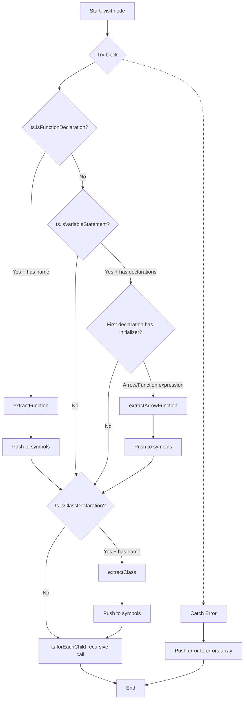

# visit

The `visit` const is a recursive tree traversal function designed to extract symbols from TypeScript AST nodes. It identifies function declarations, arrow functions, and class declarations, then processes them through specific extraction methods while gracefully handling errors and recursively visiting child nodes.

<details>
<summary>Visual Flow</summary>



</details>

<details>
<summary>Parameters</summary>

- `node: ts.Node` - A TypeScript AST node to be analyzed for extractable symbols. Can be any node type in the TypeScript syntax tree, though only function declarations, variable statements containing functions, and class declarations will be processed for symbol extraction.

</details>

<details>
<summary>Implementation Details</summary>

The function implements a visitor pattern for TypeScript AST traversal with the following key behaviors:

1. **Function Declaration Detection**: Uses `ts.isFunctionDeclaration()` to identify named function declarations and processes them via `this.extractFunction()`

2. **Arrow Function Detection**: Checks for variable statements containing arrow functions or function expressions by:
   - Verifying the node is a variable statement with declarations
   - Examining the first declaration's initializer
   - Using `ts.isArrowFunction()` or `ts.isFunctionExpression()` type guards

3. **Class Declaration Detection**: Uses `ts.isClassDeclaration()` to identify named class declarations and processes them via `this.extractClass()`

4. **Recursive Traversal**: Employs `ts.forEachChild()` to recursively visit all child nodes, ensuring complete AST coverage

5. **Error Handling**: Wraps all operations in a try-catch block, collecting errors with node position information for debugging

The function modifies two external collections:
- `symbols` array - receives extracted symbol information
- `errors` array - receives any processing errors with contextual information

</details>

<details>
<summary>Usage Examples</summary>

```typescript
// Usage within a TypeScript AST traversal context
const symbols: SymbolInfo[] = [];
const errors: string[] = [];

// Visit a source file's root node
const sourceFile = ts.createSourceFile('example.ts', sourceCode, ts.ScriptTarget.Latest);
visit(sourceFile);

// Process results
console.log(`Found ${symbols.length} symbols`);
if (errors.length > 0) {
  console.error('Extraction errors:', errors);
}
```

```typescript
// Example of nodes that would be processed
const exampleCode = `
  // Function declaration - will be extracted
  function myFunction() { return 42; }
  
  // Arrow function - will be extracted
  const myArrow = () => { return 'hello'; };
  
  // Class declaration - will be extracted
  class MyClass { 
    method() { return true; }
  }
  
  // Regular variable - will be skipped
  const myVar = 'value';
`;
```

</details>

<details>
<summary>Edge Cases</summary>

1. **Anonymous Functions**: Function declarations without names are ignored, even if they exist in the AST

2. **Multiple Variable Declarations**: Only the first declaration in a variable statement is examined for function content

3. **Nested Functions**: Inner function declarations will be visited separately due to recursive traversal, potentially creating multiple symbol entries

4. **Anonymous Classes**: Class declarations without names are skipped during extraction

5. **Error Recovery**: If extraction methods throw exceptions, the error is logged but traversal continues, preventing single node failures from stopping the entire process

6. **Complex Initializers**: Variable declarations with complex expressions that aren't direct arrow functions or function expressions are ignored

</details>

<details>
<summary>Related</summary>

- `this.extractFunction()` - Processes function declaration nodes into symbol information
- `this.extractArrowFunction()` - Processes arrow function and function expression nodes
- `this.extractClass()` - Processes class declaration nodes into symbol information
- `ts.forEachChild()` - TypeScript compiler API function for AST traversal
- `ts.isFunctionDeclaration()`, `ts.isVariableStatement()`, `ts.isClassDeclaration()` - TypeScript type guard functions
- TypeScript AST visitor pattern implementations
- Symbol extraction and code analysis utilities

</details>