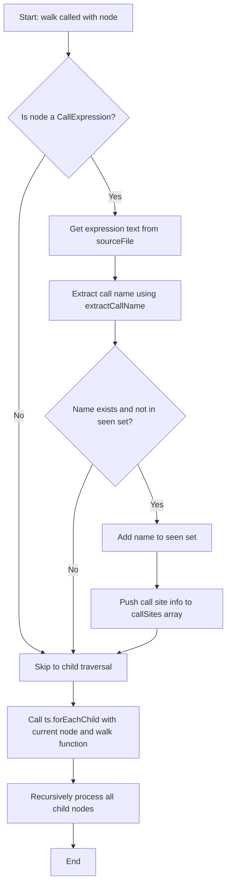

# walk

The `walk` constant defines a recursive tree traversal function that identifies and collects TypeScript call expressions from an Abstract Syntax Tree (AST). It processes each node to extract function call information, deduplicates results using a seen set, and recursively visits all child nodes to ensure complete traversal.

<details>
<summary>Visual Flow</summary>



</details>

<details>
<summary>Parameters</summary>

- `node: ts.Node` - The TypeScript AST node to analyze. This can be any node type in the TypeScript syntax tree, including expressions, statements, declarations, or structural elements.

</details>

<details>
<summary>Implementation Details</summary>

The `walk` function implements a depth-first traversal pattern using the visitor pattern common in AST processing:

1. **Call Expression Detection**: Uses `ts.isCallExpression(node)` to identify function/method call nodes
2. **Expression Text Extraction**: Retrieves the full text representation of the call expression using `node.expression.getText(sourceFile)`
3. **Name Extraction**: Delegates to `this.extractCallName()` method to parse the actual function name from complex expressions
4. **Deduplication**: Maintains a `seen` Set to prevent duplicate entries in the results
5. **Result Collection**: Stores call site information in a `callSites` array with both `name` and `expression` properties
6. **Recursive Traversal**: Uses `ts.forEachChild(node, walk)` to ensure all descendant nodes are processed

The function relies on closure variables (`sourceFile`, `seen`, `callSites`) from its containing scope, making it tightly coupled to its execution context.

</details>

<details>
<summary>Usage Examples</summary>

```typescript
// Example usage within a class method
class CallSiteAnalyzer {
  private analyzeSourceFile(sourceFile: ts.SourceFile): CallSite[] {
    const seen = new Set<string>();
    const callSites: CallSite[] = [];
    
    const walk = (node: ts.Node) => {
      if (ts.isCallExpression(node)) {
        const expression = node.expression.getText(sourceFile);
        const name = this.extractCallName(node.expression, sourceFile);
        if (name && !seen.has(name)) {
          seen.add(name);
          callSites.push({ name, expression });
        }
      }
      ts.forEachChild(node, walk);
    };
    
    // Start traversal from root
    walk(sourceFile);
    return callSites;
  }
}
```

```typescript
// Processing different types of call expressions
// Given source code: "api.getData().then(result => console.log(result))"

// The walk function would process:
// 1. CallExpression: api.getData() -> extracts "getData"
// 2. CallExpression: .then(...) -> extracts "then"  
// 3. CallExpression: console.log(result) -> extracts "log"
```

</details>

<details>
<summary>Edge Cases</summary>

- **Null/Undefined Names**: If `extractCallName()` returns `null` or `undefined`, the call site is skipped
- **Duplicate Function Names**: Only the first occurrence of each unique function name is recorded due to the `seen` Set
- **Complex Expressions**: Handles chained method calls, property access, and nested function calls through delegation to `extractCallName()`
- **Non-Call Nodes**: Safely ignores non-call expression nodes without processing
- **Empty Source Files**: Handles empty or minimal AST structures gracefully
- **Malformed AST**: May encounter nodes where `getText()` fails or returns unexpected results

</details>

<details>
<summary>Related</summary>

- `ts.isCallExpression()` - TypeScript compiler API function for type checking
- `ts.forEachChild()` - TypeScript utility for AST traversal
- `extractCallName()` - Method used to parse function names from expressions
- `Node.getText()` - TypeScript AST method for retrieving source text
- AST Visitor Pattern - Design pattern commonly used for tree traversal
- TypeScript Compiler API - Broader context for AST manipulation

</details>