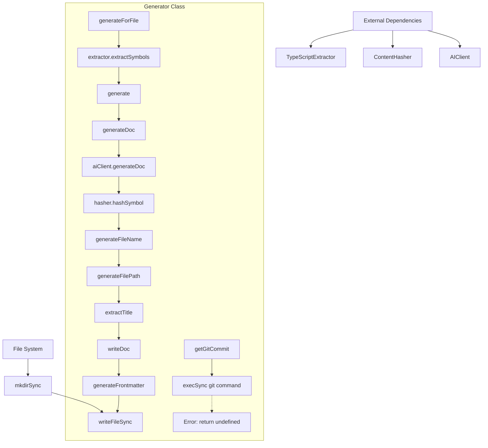

# Generator

The `Generator` class is responsible for generating AI-powered documentation for TypeScript symbols. It orchestrates the extraction of symbols from source code, generates documentation content using an AI client, and writes the results to markdown files with proper metadata and dependency tracking.

<details>
<summary>Visual Flow</summary>



</details>

<details>
<summary>Parameters</summary>

**Constructor Parameters:**
- `config`: `GeneratorConfig` - Configuration object containing:
  - `apiKey`: API key for the AI client
  - `model`: AI model to use for generation
  - `style`: Documentation style preferences
  - `outputDir`: Directory where generated documentation will be written

</details>

<details>
<summary>Methods</summary>

**Public Methods:**

- `generate(request: GenerateRequest): Promise<GenerationResult>` - Generates documentation for a single symbol and writes it to disk
- `generateForFile(filePath: string): Promise<GenerationResult[]>` - Extracts all symbols from a file and generates documentation for each one
- `getGitCommit(): Promise<string | undefined>` - Retrieves the current Git commit hash if available

**Private Methods:**

- `generateDoc(request: GenerateRequest): Promise<GeneratedDoc>` - Core documentation generation logic that creates content and metadata
- `writeDoc(doc: GeneratedDoc): void` - Writes documentation content with YAML frontmatter to the file system
- `generateFrontmatter(doc: GeneratedDoc): string` - Creates YAML frontmatter with metadata and dependencies
- `generateFilePath(symbol: SymbolInfo, fileName: string): string` - Constructs the output file path preserving directory structure
- `generateFileName(symbol: SymbolInfo): string` - Converts symbol names to kebab-case markdown filenames
- `extractTitle(content: string): string | null` - Extracts the first H1 heading from generated content

</details>

<details>
<summary>Usage Examples</summary>

**Basic Symbol Generation:**
```typescript
const config: GeneratorConfig = {
  apiKey: 'your-api-key',
  model: 'gpt-4',
  style: 'technical',
  outputDir: './docs'
};

const generator = new Generator(config);

const result = await generator.generate({
  symbol: {
    name: 'MyClass',
    type: 'class',
    filePath: './src/MyClass.ts'
  }
});

if (result.success) {
  console.log(`Documentation written to: ${result.filePath}`);
} else {
  console.error(`Error: ${result.error}`);
}
```

**Generate Documentation for Entire File:**
```typescript
const results = await generator.generateForFile('./src/utils.ts');

results.forEach((result, index) => {
  if (result.success) {
    console.log(`Symbol ${index + 1}: ${result.filePath}`);
  } else {
    console.error(`Symbol ${index + 1} failed: ${result.error}`);
  }
});
```

**With Context and Related Symbols:**
```typescript
const result = await generator.generate({
  symbol: primarySymbol,
  context: {
    projectContext: 'This is a REST API service',
    relatedSymbols: [helperFunction, dependentClass]
  },
  customPrompt: 'Focus on API usage patterns'
});
```

</details>

<details>
<summary>Implementation Details</summary>

The `Generator` class follows a pipeline architecture:

1. **Symbol Extraction**: Uses `TypeScriptExtractor` to parse source files and identify exportable symbols
2. **Content Generation**: Leverages `AIClient` to generate documentation content based on symbol information and context
3. **Dependency Tracking**: Uses `ContentHasher` to create content hashes for change detection and dependency management
4. **File Organization**: Preserves source directory structure in the output, converting symbol names to kebab-case filenames
5. **Metadata Management**: Generates YAML frontmatter with timestamps, dependencies, and hashes for each documentation file

The class maintains immutable dependency tracking by storing relative paths and content hashes, enabling incremental regeneration when source code changes. All generated files include structured frontmatter that can be parsed by documentation systems or static site generators.

</details>

<details>
<summary>Edge Cases</summary>

- **Empty Files**: `generateForFile()` returns an error result when no exportable symbols are found
- **File System Errors**: Directory creation is handled automatically with `{ recursive: true }`
- **Git Repository**: `getGitCommit()` gracefully handles non-git directories by returning `undefined`
- **AI Client Failures**: All AI generation errors are caught and returned as failed `GenerationResult` objects
- **Symbol Name Conflicts**: Kebab-case conversion may create filename collisions for symbols with similar names
- **Path Handling**: Uses relative paths in dependency tracking to ensure portability across different environments
- **Title Extraction**: Falls back to symbol name if no H1 heading is found in generated content

</details>

<details>
<summary>Related</summary>

- `TypeScriptExtractor` - Extracts symbols from TypeScript source files
- `ContentHasher` - Generates hashes for dependency tracking
- `AIClient` - Interfaces with AI services for content generation
- `GeneratorConfig` - Configuration interface for generator settings
- `GenerateRequest` - Input interface for generation requests
- `GenerationResult` - Output interface for generation results
- `SymbolInfo` - Type definition for extracted symbol metadata

</details>