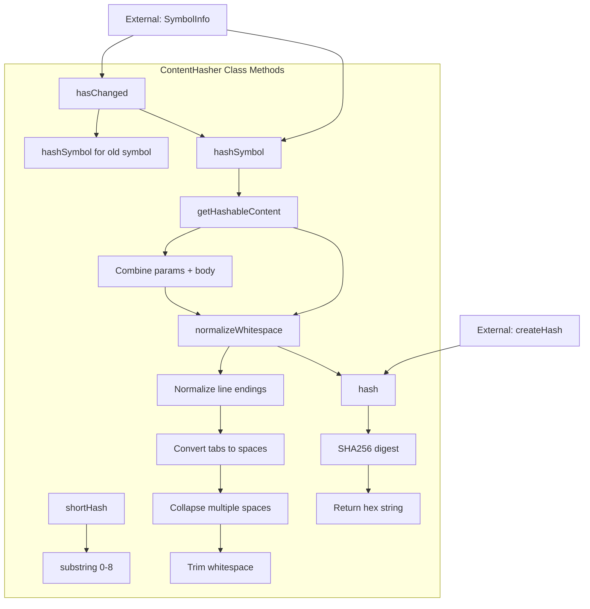

# ContentHasher

A utility class for generating content-based hashes of code symbols. It creates stable hashes by normalizing symbol content (parameters and body) while excluding elements like names and modifiers that don't affect functional behavior.

<details>
<summary>Visual Flow</summary>



</details>

<details>
<summary>Methods</summary>

- **`hashSymbol(symbol: SymbolInfo): string`** - Generates a hash for a symbol's content, excluding the name to allow renames without triggering staleness detection
- **`getHashableContent(symbol: SymbolInfo): string`** - Extracts and normalizes the content that should be hashed (parameters and body only)
- **`hash(content: string): string`** - Creates a SHA256 hash of the provided content string
- **`normalizeWhitespace(content: string): string`** - Private method that normalizes whitespace to prevent formatting changes from affecting the hash
- **`hasChanged(oldSymbol: SymbolInfo, newSymbol: SymbolInfo): boolean`** - Compares two symbols to determine if their functional content has changed
- **`shortHash(hash: string): string`** - Returns the first 8 characters of a hash for display purposes

</details>

<details>
<summary>Usage Examples</summary>

```typescript
import { ContentHasher } from './content-hasher';

// Initialize the hasher
const hasher = new ContentHasher();

// Hash a symbol
const symbol: SymbolInfo = {
  name: 'calculateTotal',
  params: '(price: number, tax: number)',
  body: '{ return price + (price * tax); }'
};

const hash = hasher.hashSymbol(symbol);
console.log(hash); // "a1b2c3d4e5f6..."

// Check if symbol changed
const oldSymbol: SymbolInfo = {
  name: 'calculateTotal',
  params: '(price: number, tax: number)',
  body: '{ return price + (price * tax); }'
};

const newSymbol: SymbolInfo = {
  name: 'calculateFinalPrice', // renamed but same logic
  params: '(price: number, tax: number)',
  body: '{ return price + (price * tax); }'
};

// This returns false because only the name changed
const changed = hasher.hasChanged(oldSymbol, newSymbol);
console.log(changed); // false

// Get short hash for display
const displayHash = hasher.shortHash(hash);
console.log(displayHash); // "a1b2c3d4"
```

</details>

<details>
<summary>Implementation Details</summary>

The `ContentHasher` implements a multi-step process for stable content hashing:

1. **Content Extraction**: Only `params` and `body` properties from `SymbolInfo` are included in the hash, deliberately excluding `name` and other metadata
2. **Whitespace Normalization**: Multiple transformations ensure formatting changes don't affect hashes:
   - Line endings normalized to `\n`
   - Tabs converted to two spaces
   - Multiple consecutive spaces collapsed to single spaces
   - Leading/trailing whitespace trimmed
3. **SHA256 Hashing**: Uses Node.js built-in `crypto.createHash()` for consistent, secure hashing
4. **Hash Comparison**: Symbol changes are detected by comparing hash values rather than direct content comparison

The normalization process is critical for preventing false positives in change detection when code is reformatted but functionally unchanged.

</details>

<details>
<summary>Edge Cases</summary>

- **Empty Content**: Symbols with empty `params` or `body` will still generate valid hashes
- **Whitespace-Only Changes**: Formatting modifications (indentation, spacing, line breaks) will not change the hash due to normalization
- **Unicode Characters**: Hash handles Unicode content correctly through UTF-8 encoding
- **Very Long Content**: SHA256 can handle arbitrarily large input, but memory usage scales with content size
- **Hash Collisions**: While theoretically possible with SHA256, probability is negligible for practical use cases
- **Null/Undefined Properties**: If `symbol.params` or `symbol.body` are undefined, they will be converted to the string `"undefined"` in the hash

</details>

<details>
<summary>Related</summary>

- **`SymbolInfo`** - Interface defining the structure of symbols being hashed
- **Node.js `crypto` module** - Provides the underlying SHA256 hashing functionality
- **Content-based caching** - Primary use case for detecting when cached symbol analysis needs refresh
- **Code analysis tools** - Often used in conjunction with parsers and AST processors

</details>