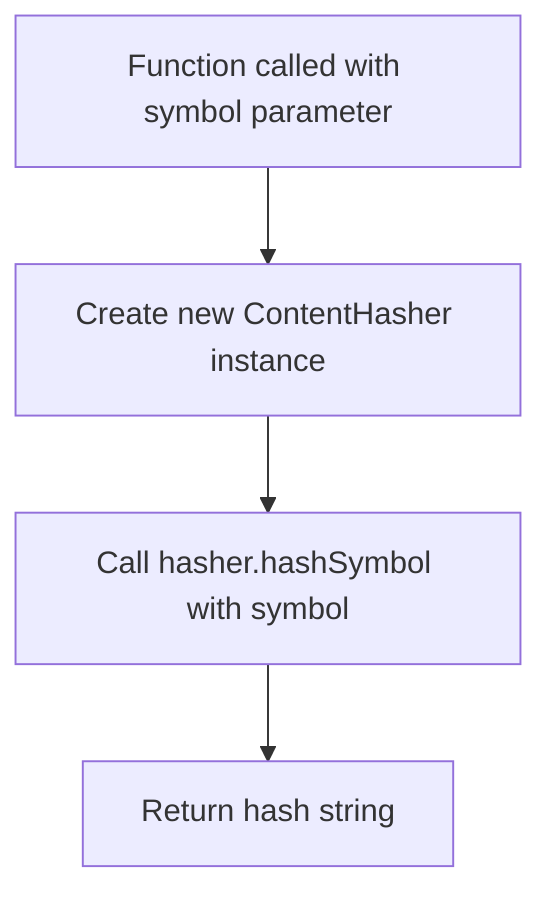

# hashSymbol

Generates a hash string for a given `SymbolInfo` object using the `ContentHasher` class. This function provides a simple wrapper around the `ContentHasher.hashSymbol()` method for creating consistent hash values of symbol information.

<details>
<summary>Visual Flow</summary>



</details>

<details>
<summary>Parameters</summary>

- `symbol`: `SymbolInfo` - The symbol information object to be hashed. This object contains the metadata and details about a symbol that will be used to generate the hash.

</details>

<details>
<summary>Return Value</summary>

Returns a `string` representing the computed hash of the provided `SymbolInfo` object. The exact format and length of the hash depend on the implementation within the `ContentHasher` class.

</details>

<details>
<summary>Usage Examples</summary>

```typescript
import { hashSymbol } from './path/to/module';

// Basic usage with a symbol info object
const symbolInfo: SymbolInfo = {
  name: 'myFunction',
  type: 'function',
  location: '/src/utils.ts',
  // ... other SymbolInfo properties
};

const hash = hashSymbol(symbolInfo);
console.log(hash); // Output: generated hash string
```

```typescript
// Using in a symbol comparison scenario
function compareSymbols(symbol1: SymbolInfo, symbol2: SymbolInfo): boolean {
  return hashSymbol(symbol1) === hashSymbol(symbol2);
}
```

```typescript
// Creating a hash map of symbols
const symbols: SymbolInfo[] = [/* array of symbols */];
const hashMap = new Map<string, SymbolInfo>();

symbols.forEach(symbol => {
  const hash = hashSymbol(symbol);
  hashMap.set(hash, symbol);
});
```

</details>

<details>
<summary>Implementation Details</summary>

The function creates a new instance of `ContentHasher` for each invocation and delegates the actual hashing logic to the `hashSymbol` method of that class. This approach ensures:

- Isolation of hashing logic within the `ContentHasher` class
- Consistent hash generation across different parts of the application
- Easy maintenance and updates to hashing algorithms by modifying only the `ContentHasher` implementation

The function serves as a convenience wrapper, eliminating the need for callers to manually instantiate `ContentHasher` objects.

</details>

<details>
<summary>Edge Cases</summary>

- If `symbol` is `null` or `undefined`, the behavior depends on the `ContentHasher.hashSymbol()` implementation
- Identical `SymbolInfo` objects should produce identical hash strings
- The function creates a new `ContentHasher` instance on each call, which may have performance implications for high-frequency usage
- Hash collisions are possible but should be rare depending on the hashing algorithm used in `ContentHasher`

</details>

<details>
<summary>Related</summary>

- `ContentHasher` - The underlying class that performs the actual hashing
- `SymbolInfo` - The type definition for the symbol parameter
- `ContentHasher.hashSymbol()` - The method that performs the actual hash computation

</details>